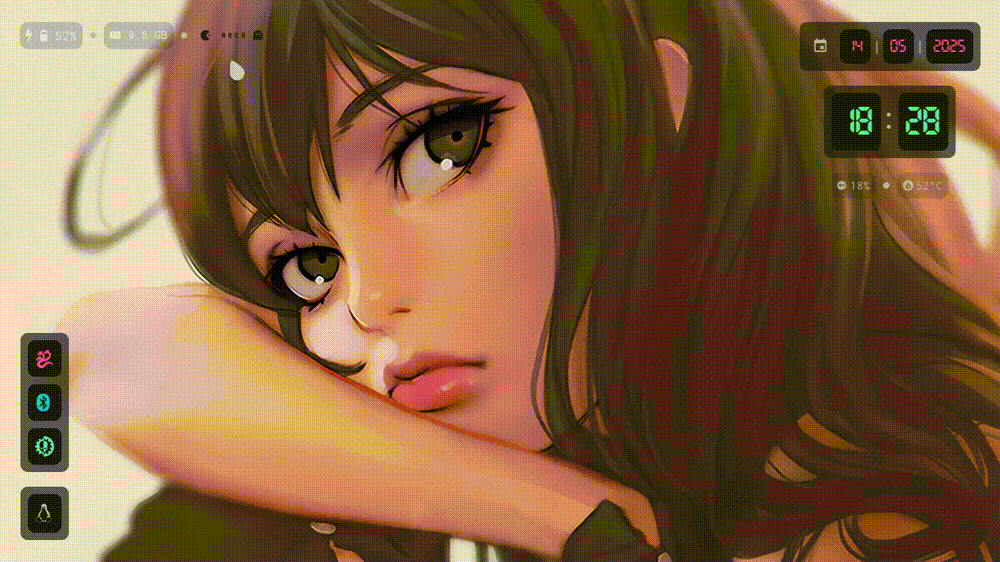

<h2 align="center"> Hyprland + EWW </h2>


- [Install](#install)
- [Post install](#post-install)
- [Keybinds](#keybinds)


<p align="center">
  
</p>


#   Install 

>[!NOTE] 
>This repository is still under construction, so the installation 
>script may present problems.

Clone the repository:
```sh
git clone https://github.com/Angell6991/Dotfiles_Angell.git
```

Enter the directory:
```sh
cd Dotfiles_Angell
```

Give execution permissions to the script:
```sh
chmod u+x install.sh                                        
```

Run:
```sh
./install.sh
```

#   Post install

## Install AUR repositorys

[Install yay](https://itsfoss.com/install-yay-arch-linux/)


## Install LaTeX, retroarch and lutris

This script will automate the personal installation of latex, retroarch and lutris

```sh
chmod u+x install_post.sh                                        
```
```sh
sudo ./install_post.sh                                        
```

#   Keybinds


## Terminal, menu, exit and close session
| Keys | Action |
|:-|:-|
|<kbd>SUPER</kbd> + <kbd>Return</kbd>| open kitty terminal
|<kbd>SUPER</kbd> + <kbd>space</kbd>| open dmenu
|<kbd>SUPER</kbd> + <kbd>BackSpace</kbd>| killactive
|<kbd>SUPER</kbd> + <kbd>ctrl</kbd> + <kbd>q</kbd>| close seccion, exit
|<kbd>SUPER</kbd> + <kbd>ctrl</kbd> + <kbd>l</kbd>| open power menu
|<kbd>SUPER</kbd> + <kbd>ctrl</kbd> + <kbd>F1</kbd>| suspend system
|<kbd>SUPER</kbd> + <kbd>ctrl</kbd> + <kbd>F9</kbd>| enable and disable lock


## Switching between window types
| Keys | Action |
|:-|:-|
|<kbd>SUPER</kbd> + <kbd>ctrl</kbd> + <kbd>f</kbd>| togglefullscreen
|<kbd>SUPER</kbd> + <kbd>f</kbd>| togglefloating
|<kbd>SUPER</kbd> + <kbd>p</kbd>| pseudo, # dwindle
|<kbd>SUPER</kbd> + <kbd>w</kbd>| toggle layout: scrolling, master, dwindle


## Brightness, audio, screenshot and recording controls 
| Keys | Action |
|:-|:-|
|<kbd>SUPER</kbd> + <kbd>F6</kbd>| +10% screen brightness
|<kbd>SUPER</kbd> + <kbd>F5</kbd>| -10% screen brightness
|<kbd>SUPER</kbd> + <kbd>F12</kbd>| +5% volume
|<kbd>SUPER</kbd> + <kbd>F11</kbd>| -5% volume
|<kbd>SUPER</kbd> + <kbd>F10</kbd>| muted and unmuted system
|<kbd>SUPER</kbd> + <kbd>ctrl</kbd> + <kbd>F10</kbd>| paused and unpaused music system
|<kbd>SUPER</kbd> + <kbd>Print</kbd>| screenshot
|<kbd>SUPER</kbd> + <kbd>ctrl</kbd> + <kbd>Print</kbd>| capture a section of the screen
|<kbd>SUPER</kbd> + <kbd>F3</kbd>| start recording the screen
|<kbd>SUPER</kbd> + <kbd>F4</kbd>| stop screen recording
|<kbd>SUPER</kbd> + <kbd>F8</kbd>| Search color Hexadecimal
|<kbd>SUPER</kbd> + <kbd>F7</kbd>| zbarimg screen QR

## Window behavior in workspace
| Keys | Action |
|:-|:-|
|<kbd>SUPER</kbd> + <kbd>left, right, up, down</kbd>| Move the focus of the windows
|<kbd>SUPER</kbd> + <kbd>SHIFT</kbd> + <kbd>left, right, up, down</kbd>| Movewindow
|<kbd>ctrl</kbd> + <kbd>SHIFT</kbd> + <kbd>j, l, i, k</kbd>| Resize window
|<kbd>SUPER</kbd> + <kbd>tab</kbd>| Move focus between float and tilling
|<kbd>SUPER</kbd> + <kbd>ctrl</kbd> + <kbd>left, right, up, down</kbd>| Move focus between active workspaces
|<kbd>SUPER</kbd> + <kbd>1, 2, 3, 4, 5, 6</kbd>| Moving between workspaces
|<kbd>SUPER</kbd> + <kbd>ctrl</kbd> + <kbd>1, 2, 3, 4, 5, 6</kbd>| Move window to a workspace
|<kbd>ctrl</kbd> + <kbd>SHIFT</kbd> + <kbd>1, 2, 3, 4, 5, 6</kbd>| Move window to a workspace without changing focus

## Active submap: SUPER + r
| Keys | Action |
|:-|:-|
|<kbd>w</kbd> | changing wallpaper
|<kbd>esc: escape</kbd> | exit mode submap


